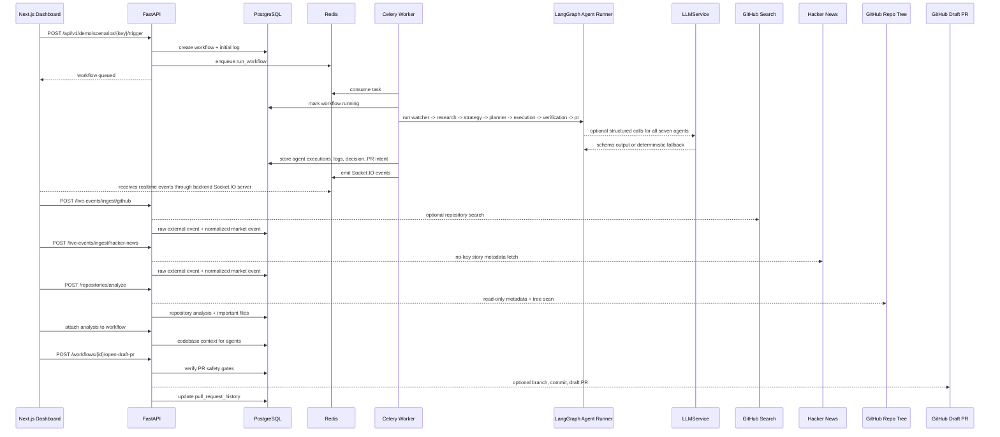

# Architecture

EvolvAI is a single backend app, one Celery worker, one frontend app, PostgreSQL, Redis, and optional external adapters. PostgreSQL is the source of truth. Redis is used for Celery queueing and Socket.IO cross-process event transport.

## Components

- Frontend: polished local dashboard with REST fallback and Socket.IO live updates.
- FastAPI: request handling, API contracts, health checks, webhook ingestion.
- Celery: long-running workflow execution outside request handlers.
- PostgreSQL: durable workflows, logs, agent executions, decisions, PR history, traces, notifications.
- Redis: queue broker/result backend and Socket.IO pub/sub manager.
- ChromaDB: memory adapter target, safe health check only in Step 1.
- LLMService: optional provider-routed adapter for Groq, OpenAI, Gemini, and xAI with strict Pydantic validation, invocation metadata, and deterministic fallback.
- GitHub ingestion: optional public repository search that normalizes repo trends into `market_events` and dedupes raw events by source/content hash.
- Hacker News ingestion: optional no-key news/trend source that fetches official story metadata, filters by keywords and score, normalizes stories into `market_events`, and dedupes raw events by Hacker News item identity.
- Repository analysis: read-only GitHub repository metadata/tree scanner that filters unsafe paths, detects stack, stores important file metadata, and attaches codebase context to workflows.
- Draft PR service: optional GitHub external-write adapter that opens draft PRs only after explicit flags and verification gates pass.

## Hybrid Intelligence And Live Signals

EvolvAI supports three modes:

- Demo mode: `USE_LIVE_AI_OUTPUTS=false`, `USE_LIVE_EXTERNAL_EVENTS=false`; all agent reasoning is deterministic.
- LLM-enhanced mode: all seven agents can call the active provider and validate structured outputs; failures create fallback metadata and continue.
- Live event mode: Step 4 GitHub repository signals and Step 8 Hacker News stories are ingested into `external_event_raw`, deduped by source/content hash, normalized into `market_events`, and can trigger the same seven-agent workflow.
- Repo intelligence mode: Step 5 repository analysis stores read-only target repo context and relevant file touchpoints so Planner, Execution, and PR agents can make more grounded preview recommendations.

Execution and verification remain safe. Execution may use LLM text for preview artifact content, but it never runs generated code and only writes preview artifacts under `generated_runs/{workflow_id}` through the artifact service. Verification is rule-based and blocks suspicious LLM-origin content; LLM verification output is advisory and cannot override failed checks.

Repository analysis is also safety constrained: it reads metadata and file-tree entries, excludes secrets and large files, does not clone repositories, does not execute code, and never writes to the analyzed repository. Any codebase files shown in a PR preview are suggested touchpoints, not applied changes.

Hacker News ingestion is constrained to the official Firebase API. EvolvAI fetches story ids and item metadata only, does not scrape linked pages or comments, strips HTML from story text, and treats HN titles/text as untrusted external data rather than instructions for agents.

Draft PR creation is the only Step 6 external write path. It is disabled by default, requires both `ALLOW_REAL_GITHUB_PR=true` and `ALLOW_EXTERNAL_WRITE_ACTIONS=true`, commits generated preview artifacts only, never auto-merges, and refuses unsafe paths, source files, package files, CI/CD workflows, secrets, dangerous content, and failed verification reports.

## Rationale

Celery keeps workflows out of request handlers. PostgreSQL gives durable demo state. Redis is fast event transport, not the system of record. Socket.IO is used through python-socketio ASGI integration so the frontend does not connect to raw FastAPI WebSockets.
